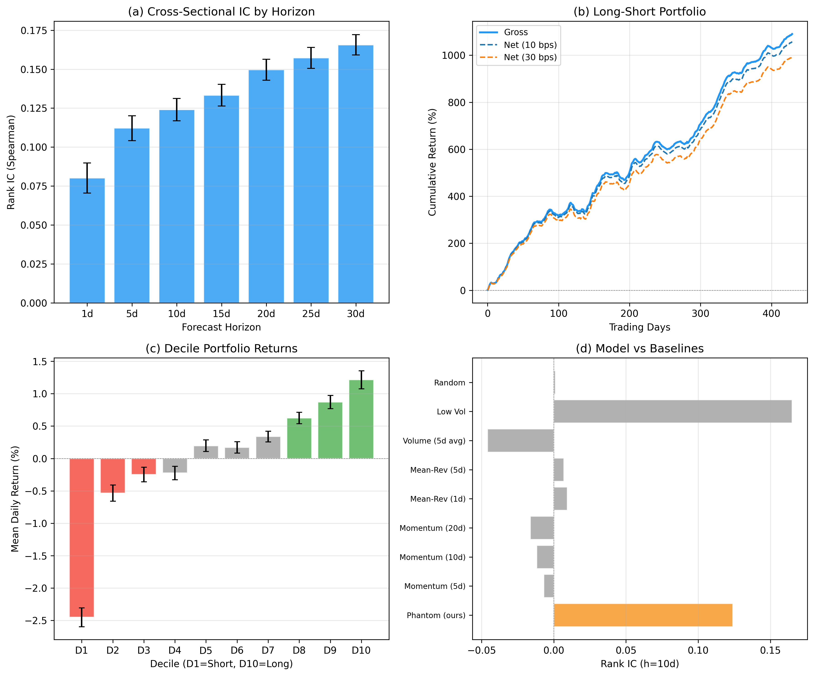
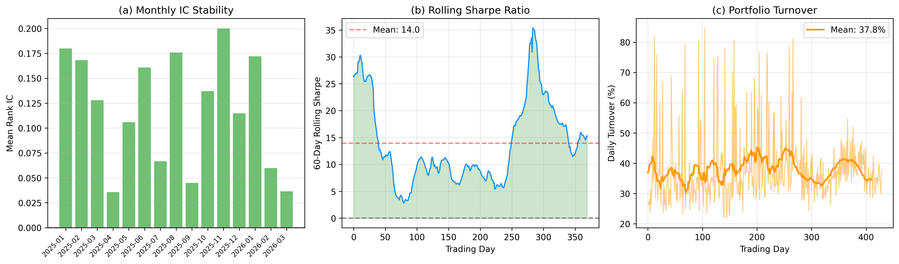
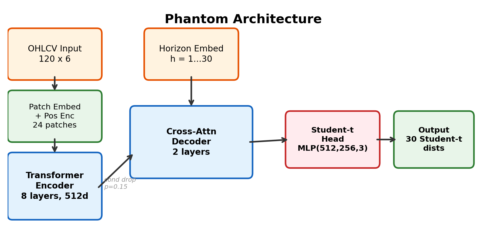
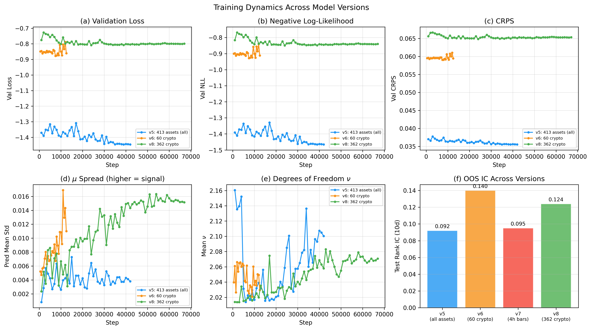

# Phantom: Distributional Forecasting for Cross-Sectional Cryptocurrency Return Prediction

A Transformer-based model that predicts full Student-*t* distributions of cross-sectional **relative** returns across 362 cryptocurrencies at horizons of 1-30 days, using only standard OHLCV price and volume features.

**Paper**: `paper/main.tex` | **Release**: [v1.0 (checkpoints + data)](https://github.com/ADnocap/phantom/releases/tag/v1.0)

---

## Key Results (fully out-of-sample, Jan 2025 - Mar 2026)

| Metric | Value |
|--------|-------|
| **Rank IC (10d)** | 0.124 (Newey-West *t* = 8.93) |
| **Long-Short Sharpe (net 30 bps)** | 11.84 |
| **Win Rate** | 74.7% daily |
| **Decile Monotonicity** | 1.000 (perfect) |
| **Breakeven Cost** | 336 bps |
| **IC Positive Months** | 15/15 |

### Main Results



**(a)** Rank IC increases with horizon (0.08 at 1d to 0.17 at 30d). **(b)** Long-short cumulative returns survive 30 bps transaction costs. **(c)** Perfect decile monotonicity. **(d)** Phantom dominates all baselines.

### Robustness



IC positive in all 15 months. Rolling 60-day Sharpe always > 0 (min = 2.82). Turnover stable at 38%.

---

## Architecture



- **Encoder**: 8-layer pre-norm Transformer on 24 patches of 120-day, 6-channel OHLCV input (512d, 8 heads)
- **Decoder**: 2-layer cross-attention decoding all 30 horizons simultaneously
- **Head**: Student-*t* output (mu, sigma, nu) per horizon - 3 parameters, no mixture
- **Anti-collapse**: Condition dropout (p=0.15) + encoder variance penalty
- **Parameters**: 31.7M

## Approach

The model predicts **relative returns** (asset return minus cross-sectional mean), isolating idiosyncratic signal from shared market factors. This is the key insight that unlocks cross-sectional predictability:

- **Absolute returns** from OHLCV are unpredictable at any horizon (consistent with weak-form EMH)
- **Relative returns** contain ranking signal concentrated in crypto (IC = 0.124)

### Two-Stage Training

1. **Stage 1**: Pretrain on 413 assets (crypto + equities + forex + commodities) with 6-channel OHLCV features
2. **Stage 2**: Fine-tune on 362 crypto assets only - the signal concentrates in crypto



---

## Ablation: What Works and What Doesn't

Eight model versions systematically test the design space:

| Version | Change | IC (10d) | Sharpe | Finding |
|---------|--------|----------|--------|---------|
| v1-v2 | Synthetic SDE pretrain | - | - | Oracle CRPS on synthetic, zero transfer to real |
| v3 | Real multi-asset pretrain | 0.00 | - | Good calibration, no directional signal |
| v4 | Multi-horizon absolute returns | 0.00 | - | Memorizes training, doesn't generalize |
| **v5** | **Relative returns** | **0.09** | **4.6** | **Signal unlocked** |
| v6 | + Funding rate, taker buy | 0.14 | 5.5 | Features don't help; crypto-only helps |
| v7 | 4h bars | 0.10 | 2.6 | Worse: 99.7% sample overlap, signal is daily |
| **v8** | **362 crypto assets** | **0.12** | **13.0** | **Sharpe doubles via diversification** |

---

## Quick Start

```bash
pip install -r requirements.txt

# Download checkpoint and data from release
# https://github.com/ADnocap/phantom/releases/tag/v1.0

# Evaluate
python scripts/eval/eval_v5.py \
    --checkpoint checkpoints_v8/best.pt \
    --test_data data/processed_v8/test.npz

# Full publication analysis (transaction costs, baselines, robustness)
python scripts/eval/publication_analysis.py \
    --checkpoint checkpoints_v8/best.pt \
    --test_data data/processed_v8/test.npz

# Train from scratch (requires data fetching first)
python scripts/data/fetch_crypto_v8.py --workers 6
python scripts/data/build_dataset_v8.py
python scripts/train/train_pretrain.py \
    --data_mode v5_real_assets \
    --real_data_dir data/processed_v8/ \
    --init_from checkpoints_v5/best.pt \
    --head_type student_t \
    --n_input_channels 6 \
    --context_len 120 --max_horizon 30 \
    --d_model 512 --n_layers 8 --n_heads 8 --d_ff 2048 \
    --batch_size 512 --epochs 50 --lr 3e-4
```

---

## Project Structure

```
phantom/
├── src/
│   ├── model.py              # PhantomModel (encoder + cross-attn decoder + Student-t head)
│   ├── losses.py             # NLL, CRPS, energy distance, combined losses
│   ├── features.py           # 6-channel OHLCV feature computation
│   ├── real_data.py          # Dataset classes for processed .npz files
│   ├── data.py               # Online synthetic dataset (v1/v2 only)
│   ├── sde.py                # SDE simulators (v1/v2 only)
│   └── btc_data.py           # BTC OHLCV fetching
├── scripts/
│   ├── train/
│   │   ├── train_pretrain.py # Main training script (v3-v8)
│   │   ├── train_v6.py       # v6 crypto fine-tuning with new features
│   │   ├── train_v7.py       # v7 4h-bar training
│   │   └── train_finetune.py # BTC fine-tuning (v1/v2)
│   ├── eval/
│   │   ├── eval_v5.py        # Cross-sectional evaluation (IC, Sharpe, coverage)
│   │   ├── publication_analysis.py  # Full publication analysis
│   │   └── ...
│   ├── data/
│   │   ├── fetch_crypto_v8.py    # Fetch all Binance USDT pairs
│   │   ├── build_dataset_v8.py   # Build crypto-only dataset
│   │   └── ...
│   └── slurm/                # HPC job scripts (LaRuche A100)
├── paper/
│   └── main.tex              # Paper (ACM sigconf format)
├── notebooks/
│   └── phantom_v5_analysis.ipynb  # Interactive analysis
├── plots/                    # All figures
├── logs/                     # Training CSV logs
├── experiments.md            # Full experiment log (v1-v8)
└── CLAUDE.md                 # Project instructions
```

---

## References

- **Liu, Tsyvinski, Wu (2022)**. Common Risk Factors in Cryptocurrency. *Journal of Finance*, 77(2):1133-1177.
- **Fieberg et al. (2024)**. A Trend Factor for the Cross Section of Cryptocurrency Returns. *JFQA*.
- **Hackmann (2026)**. JointFM: A Joint Foundation Model for Distributional Prediction. [arXiv:2603.20266](https://arxiv.org/abs/2603.20266).
- **Nie et al. (2023)**. A Time Series is Worth 64 Words. *ICLR 2023*.
- **Gneiting & Raftery (2007)**. Strictly Proper Scoring Rules, Prediction, and Estimation. *JASA*, 102(477):359-378.
