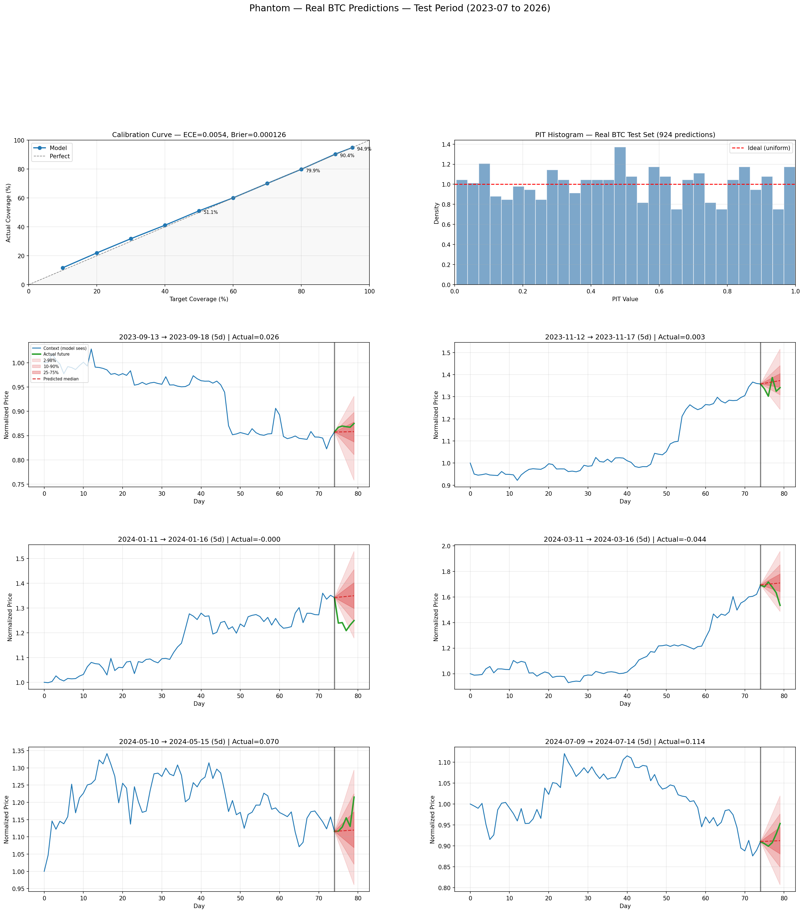
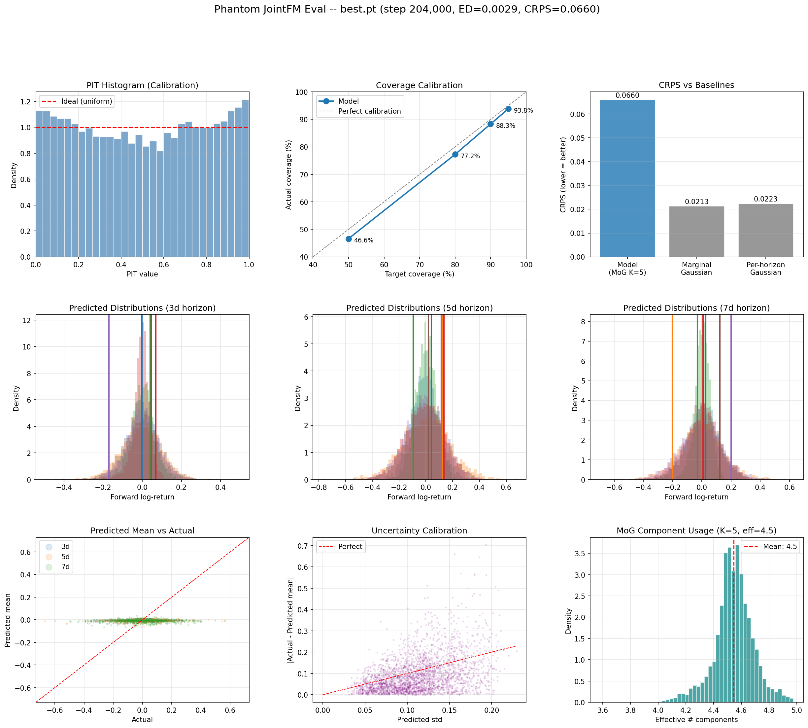
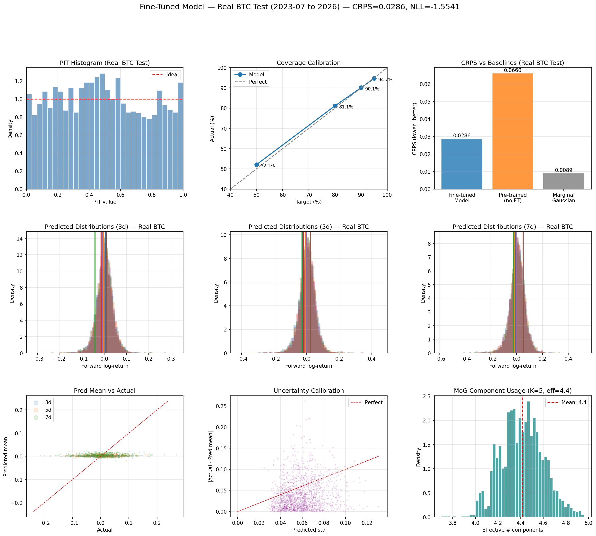
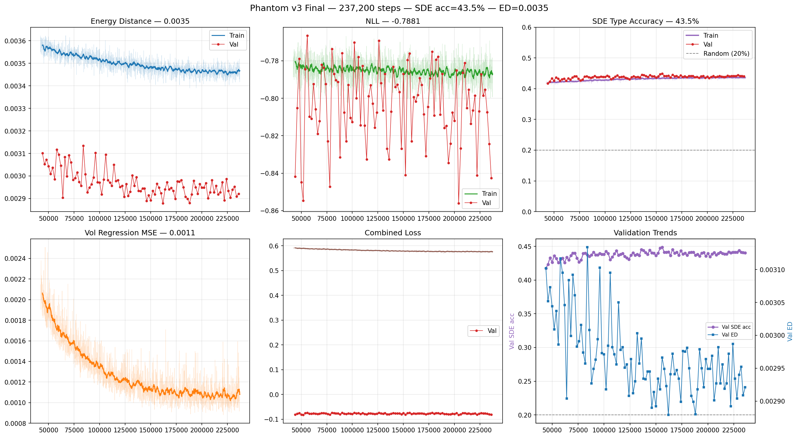
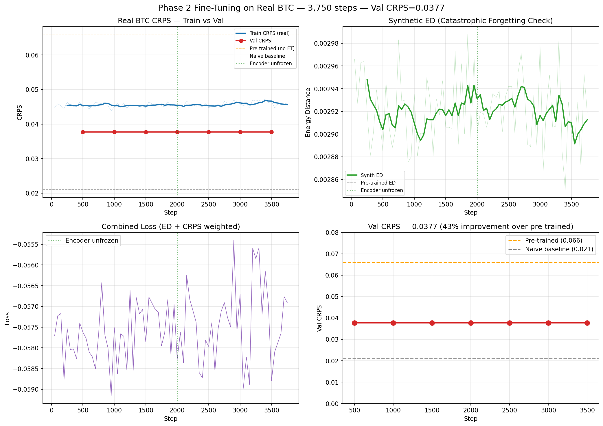
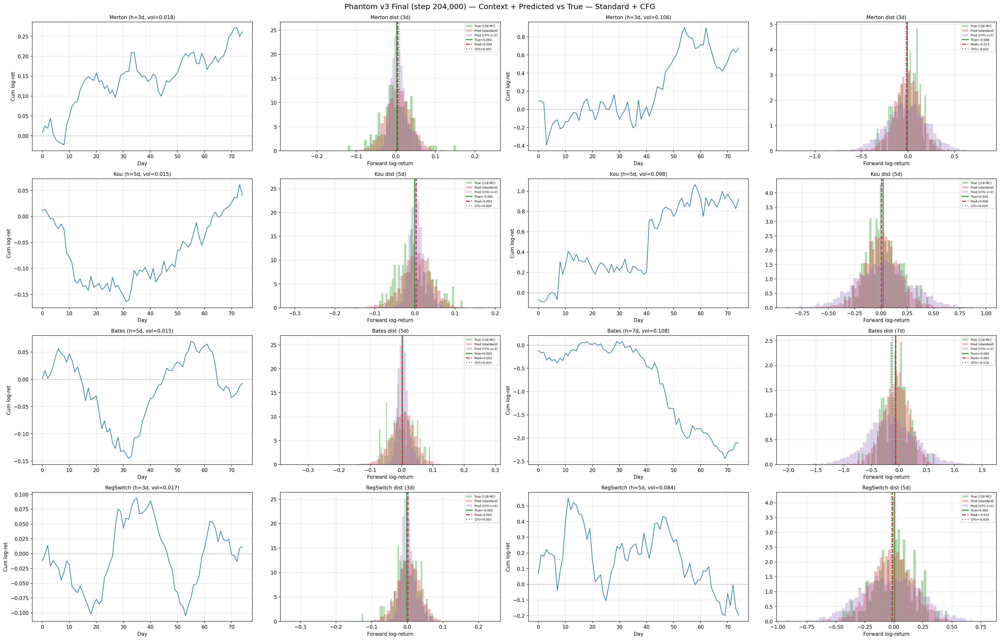

# Phantom: Synthetic Pre-Training for Bitcoin Distributional Prediction

_Adapting the methodology from [JointFM-0.1 (Hackmann, 2026)](https://arxiv.org/abs/2603.20266) — a foundation model pre-trained on synthetic SDE trajectories — to single-asset probabilistic forecasting of BTC/USD over 3–7 day horizons._

---

## Results

### Real BTC Predictions (Out-of-Sample: 2023–2026)



The model produces calibrated prediction intervals on real BTC price paths. Blue = 75-day context (model input), green = actual future, red fans = predicted distribution (2.5–97.5%, 10–90%, 25–75% intervals). Calibration curve (top-left) shows ECE = 0.005 with coverage within 1% of target at all levels.

### Pre-Training Evaluation (Synthetic Data)



### Fine-Tuning Evaluation (Real BTC Test Set)



### Training Curves

<details>
<summary>Pre-training curves (90 epochs)</summary>



SDE type classification accuracy reaches 43.8% (2x random baseline of 20%), confirming the encoder extracts input-dependent features.
</details>

<details>
<summary>Fine-tuning curves</summary>



Fine-tuning converges in ~500 steps. Val CRPS improves from 0.066 (pre-trained) to 0.038 with no catastrophic forgetting (synthetic ED stays at 0.003).
</details>

### Summary

| Metric | Pre-trained | Fine-tuned |
|--------|------------|------------|
| Energy Distance | 0.0029 | — |
| CRPS (test set) | 0.066 (synthetic) | 0.029 (real BTC) |
| ECE | — | 0.005 |
| Coverage 50/80/90/95% | 47/77/88/94 | 52/81/90/95 |
| SDE Accuracy | 43.8% | — |
| Effective K | 4.5/5 | 4.4/5 |
| NLL | -0.825 | -1.554 |

---

### Predicted vs True Distributions (Synthetic Data, by SDE Type)



Each row shows a different SDE type (Merton, Kou, Bates, Regime-Switching), with low-volatility contexts on the left and high-volatility on the right. Green = true MC branches, red = standard prediction, purple = classifier-free guidance (sharper).

---

## Architecture

```
Input: 75 daily log-returns (raw, no normalization)
  │
  ▼
Patch Embedding (5-day patches → d_model=512)
  │
  ▼
Transformer Encoder (8 layers, 8 heads, Pre-LN)
  │                          ┌─ SDE Type Classifier (5-way)
  ├── Auxiliary Heads ───────┤
  │                          └─ Volatility Regressor
  ▼
Cross-Attention Decoder (horizon query attends to all encoder patches)
  │
  ▼
MoG Head → K=5 Gaussian components (π, μ, σ)
```

### Key Design Choices

Three mechanisms prevent the "predict the marginal" collapse:

1. **Cross-attention decoder**: horizon query attends to ALL encoder patches — input-independent predictions are architecturally impossible
2. **Auxiliary tasks**: SDE type classifier + volatility regressor force the encoder to extract input-dependent features
3. **Condition dropout** (15%): enables classifier-free guidance at inference — amplifies conditional signal

Additional:
- **No normalization** — raw log-returns preserve conditional signal (RevIN destroys it; see lessons learned below)
- **JointFM-style branched futures**: 128 MC paths per sample from shared terminal state
- **Energy distance** as primary loss + auxiliary NLL (weight 0.1)

---

## SDE Families

Five SDE families for synthetic data generation, sampled with weights [5%, 15%, 30%, 30%, 20%]:

| Family | Key Feature | Parameters |
|--------|------------|------------|
| **GBM** | Baseline (constant vol) | μ, σ |
| **Merton Jump-Diffusion** | Poisson jumps (symmetric) | μ, σ, λ, μ_j, σ_j |
| **Kou Double-Exponential** | Asymmetric jumps (crashes > rallies) | μ, σ, λ, η₁, η₂, p |
| **Bates** | Stochastic vol + jumps (most expressive) | μ, σ, κ, θ, ξ, ρ, λ, μ_j, σ_j |
| **Regime-Switching GBM** | Bull/bear/sideways regimes | μₖ, σₖ, Q matrix |

Parameters are sampled from broad BTC-plausible priors (see `src/sde.py:sample_params`). Simulation runs at hourly resolution (dt = 1/(365×24)) and returns daily log-returns.

---

## Training Pipeline

### Phase 1: Synthetic Pre-Training

Each training step:
1. Sample random SDE type and parameters from priors
2. Simulate 75-day context path at hourly resolution
3. Branch 128 independent future paths from the terminal state (3/5/7 day horizons)
4. Train with energy distance (MoG samples vs MC branches) + auxiliary NLL + SDE classification + vol regression

Online generation (infinite data, no pre-generated shards needed). 90 total epochs across two runs (30 epochs at LR=3e-4, then 60 epochs at LR=1e-4).

### Phase 2: Fine-Tuning on Real BTC

Mixed batches: 70% synthetic (energy distance) + 30% real BTC (CRPS loss).

Real data: Bitstamp (2015-2017) + Binance (2017-2026), stitched via ccxt. 4,110 daily observations yielding 7,425 training / 1,617 validation / 3,000 test samples (rolling windows × 3 horizons).

Gradual unfreezing: head+decoder only for 2K steps, then full model with layer-wise LR decay (0.7x per layer). L2-SP regularization toward pre-trained weights prevents catastrophic forgetting.

---

## Loss Functions

| Phase | Primary Loss | Auxiliary | Target |
|-------|-------------|-----------|--------|
| Pre-training | Energy Distance (MoG vs 128 MC branches) | NLL (0.1×) + SDE classifier + vol regressor | Conditional distribution |
| Fine-tuning (synthetic) | Energy Distance | NLL (0.1×) | Conditional distribution |
| Fine-tuning (real) | Closed-form CRPS | NLL (0.05×) | Single realization |

Energy distance: ED(P,Q) = 2E[|X-Y|] - E[|X-X'|] - E[|Y-Y'|], computed via reparameterized MoG samples and sorted-array trick for O(N log N) pairwise terms.

---

## Lessons Learned

### RevIN Destroys Conditional Signal

Early versions used RevIN (Reversible Instance Normalization) from PatchTST. This produced perfect calibration but the model predicted the **marginal distribution regardless of input** — CRPS was 3x worse than a naive Gaussian baseline.

**Root cause**: RevIN normalizes every input to mean=0, std=1. For GBM paths, normalized returns are i.i.d. standard normal — the transformer sees identical distributions for every sample. RevIN.inverse() then provides correct scale/location "for free." JointFM uses **no normalization at all**.

### Single-Scalar Targets + NLL = Marginal Trap

Training on one future realization per context with NLL loss makes predicting the marginal a stable local minimum. The gradient from one point is too weak to push toward conditional predictions. JointFM solves this by branching thousands of future paths as the training target.

### MeanAbsScaling Doesn't Help Either

Replacing RevIN with Chronos-style mean absolute scaling (divide by mean |returns|) still allows the model to predict a constant in normalized space, with the scaler providing the rescaling. The issue is ANY normalization + denormalization shortcut, not specifically RevIN.

### Auxiliary Tasks Break the Collapse

The encoder can produce constant representations because energy distance (averaged over diverse training data) approximately accepts the marginal as a minimum. Auxiliary tasks (SDE type classification, volatility regression) create direct gradient signal that forces the encoder to produce input-dependent features — a constant vector cannot correctly classify 5 SDE types.

### Condition Dropout Amplifies Signal

Randomly zeroing the encoder output during training (15% probability) teaches the model what its predictions look like WITHOUT context. At inference, classifier-free guidance extrapolates: `output = unconditional + scale × (conditional - unconditional)`, amplifying the conditional signal ~2x.

---

## Project Structure

```
phantom/
├── src/                          # Core library
│   ├── model.py                  # PhantomModel (encoder + cross-attn decoder + MoG head)
│   ├── losses.py                 # Energy distance, NLL, CRPS
│   ├── sde.py                    # 5 SDE simulators (Numba JIT) + branched future generation
│   ├── data.py                   # OnlineDataset, ShardDataset, make_validation_batch
│   ├── generator.py              # Parallel shard generation
│   └── btc_data.py               # Real BTC data fetching (ccxt: Bitstamp + Binance)
├── scripts/
│   ├── train/
│   │   ├── train_pretrain.py     # Phase 1: synthetic pre-training
│   │   └── train_finetune.py     # Phase 2: mixed fine-tuning on real BTC
│   ├── eval/
│   │   ├── eval_model.py         # Full 9-panel evaluation (PIT, coverage, CRPS, etc.)
│   │   └── visualize_btc.py      # BTC price paths with prediction fans + calibration
│   └── slurm/                    # HPC cluster job scripts (LaRuche A100)
├── plots/                        # All evaluation and training curve plots
│   ├── pretrain_*.png            # Pre-training phase results
│   └── finetune_*.png            # Fine-tuning phase results
├── logs/                         # Training metrics (CSV)
│   ├── pretrain/
│   └── finetune/
├── generate.py                   # CLI for synthetic data generation
├── requirements.txt
└── CLAUDE.md
```

## Running

```bash
pip install -r requirements.txt

# Phase 1: Synthetic pre-training (online generation)
python scripts/train/train_pretrain.py \
    --data_mode online --samples_per_epoch 1000000 \
    --context_len 75 --d_model 512 --n_layers 8 --n_heads 8 --d_ff 2048 \
    --n_branches 128 --n_model_samples 256 --nll_weight 0.1 --aux_weight 0.5 \
    --cond_drop_prob 0.15 --n_decoder_layers 2 \
    --batch_size 256 --epochs 30 --lr 3e-4

# Phase 2: Fine-tune on real BTC
python scripts/train/train_finetune.py \
    --pretrained checkpoints/best.pt \
    --real_fraction 0.3 --steps 10000 \
    --lr_head 1e-4 --lr_encoder 3e-5 --freeze_encoder_steps 2000

# Evaluate
python scripts/eval/eval_model.py --checkpoint checkpoints/best.pt
python scripts/eval/visualize_btc.py --checkpoint checkpoints_ft/best.pt
```

---

## References

- **JointFM-0.1**: Hackmann, S. (2026). _JointFM-0.1: A Foundation Model for Multi-Target Joint Distributional Prediction._ [arXiv:2603.20266](https://arxiv.org/abs/2603.20266)
- **PatchTST**: Nie, Y. et al. (2023). _A Time Series is Worth 64 Words._ ICLR 2023.
- **Chronos**: Ansari, A.F. et al. (2024). _Chronos: Learning the Language of Time Series._ [arXiv:2403.07815](https://arxiv.org/abs/2403.07815)
- **Moirai 2.0**: Liu, S. et al. (2025). _When Less Is More for Time Series Forecasting._ [arXiv:2511.11698](https://arxiv.org/abs/2511.11698)
- **RevIN**: Kim, T. et al. (2022). _Reversible Instance Normalization for Accurate Time-Series Forecasting._ ICLR 2022.
- **Kou Jump-Diffusion**: Kou, S. G. (2002). _A Jump-Diffusion Model for Option Pricing._ Management Science, 48(8).
- **Bates Model**: Bates, D. S. (1996). _Jumps and Stochastic Volatility._ Review of Financial Studies, 9(1).
- **CRPS**: Gneiting, T. & Raftery, A. E. (2007). _Strictly Proper Scoring Rules, Prediction, and Estimation._ JASA, 102(477).
- **Energy Distance**: Szekely, G. J. & Rizzo, M. L. (2013). _Energy statistics._ Journal of Statistical Planning and Inference, 143(8).
